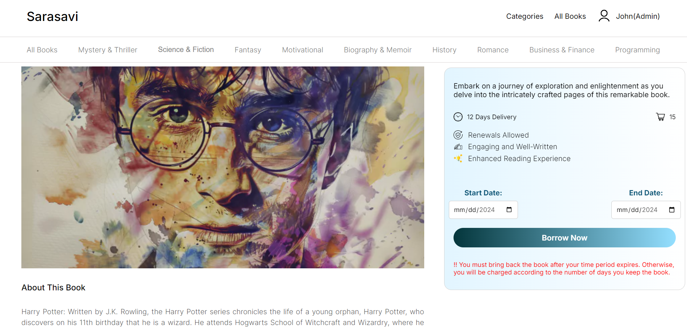

<p align="center">
  
  
</p>

<p align="center">
  
  
</p>

<p align="center">
  
  
</p>

<p align="center">
  
  
</p>

<p align="center">
  
  
</p>

# [Library Management System](#library-management-system)

## 📋 [Table of Contents](#table-of-contents)
1. 🤖 [Introduction](#introduction)
2. ⚙️ [Tech Stack](#tech-stack)
3. 🔋 [Features](#features)
4. 🤸 [Quick Start](#quick-start)

## 🤖 [Introduction](#introduction)
The Library Management System is a full-stack web application aimed at book enthusiasts and library administration staff. It streamlines book borrowing, order management, and communication between users and admins. The system includes user authentication, real-time messaging, and an admin dashboard for managing books, categories, and users.

## ⚙️ [Tech Stack](#tech-stack)
- **Frontend**: React.js
- **Backend**: Node.js with Express
- **Database**: MongoDB
- **Styling**: SASS
- **Real-time Communication**: Socketio

## 🔋 [Features](#features)
👉 **User Authentication**: Secure login for users and admins with password encryption.

👉 **Book Browsing**: Users can view books by category, search for books, and place orders.

👉 **Order Management**: Users can place and manage book orders, which admins can approve or reject.

👉 **Chat System**: Real-time messaging between users and admins using WebSockets.

👉 **Admin Dashboard**: Admins can manage users, books, and categories, and view statistics on book and user counts.(CRUD)

👉 **Profile Management**: Users can update their profile information.

👉 **Error Handling**: Graceful error handling, including user authentication, order processing, and data retrieval.


## 🤸 [Quick Start](#quick-start)

1. **Clone the repository**:
   ```bash
   git clone https://github.com/vidmal001/Library-Management-System.git
   ```

2. **Navigate to the client folder**:
   ```bash
   cd client
   ```

3. **Install the client dependencies**:
   ```bash
   npm install
   ```

4. **Navigate to the server folder**:
   ```bash
   cd server
   ```

5. **Install the server dependencies**:
   ```bash
   npm install
   ```

6. **Navigate to the socket folder**:
   ```bash
   cd socket
   ```

7. **Install the socket dependencies**:
   ```bash
   npm install
   ```

8. **Set up environment variables**:
   
   **Server Side (.env)**:
   - Navigate to the `server` folder.
   - Create a file named `.env` in the root.
   - Add the following:
     ```env
     DB_LOCATION = mongodb+srv://<your-database-username>:<your-database-password>@cluster0.mongodb.net/?retryWrites=true&w=majority
     JWT_SECRET_KEY = <your-secret-access-key>
     ```
   **How to Generate and Add a JWT_SECRET_KEY**
   - Generate a Secure Key: You can generate a secure secret access key using a secure password generator tool like [passwordsgenerator.net](https://passwordsgenerator.net) or by running the following command in your terminal:
     ```bash
     openssl rand -hex 64
     ```

 9. **Run the client**:
   ```bash
   npm start
   ```

10. **Run the server**:
   ```bash
   npm start
   ```

11. **Run the socket server**:
   ```bash
   npm start
   ```

Now the application should be running at [http://localhost:3000](http://localhost:3000).

Happy coding!